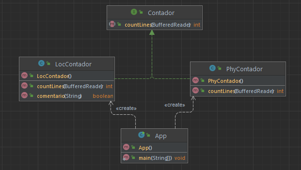
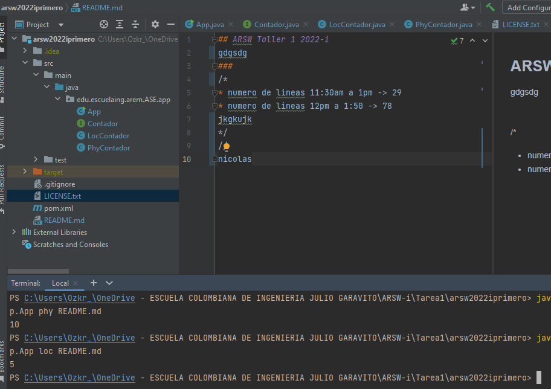

## ARSW Taller 1 2022-i

## Autor
### Oscar Nicolas Piñeros Campo

## Fecha

### 8 de Marzo del 2022

## Diagrama de Clases

La clase `App` es nuestra clase principal a la cual pasamos los argumentos
del tipo de conteo que realizaremos y el archivo al cual
realizaremos el conteo. Esta clase realiza la creacion de la Clase `LocContador` (Conteo de
lineas sin espacios ni comentarios) o `PhyContador` (conteo
de lineas total) dependiendo el tipo que hayamos seleccionado
estas dos clases implementan la Interfaz `Contador` donde
sobreescribimos el metodo de conteo.

## Prueba

## LOC/h
* numero de lineas 11:30am a 1pm -> 29
* numero de lineas 12pm a 1:50 -> 60
* numero de lineas 2:50 a 4:05 -> 80

### LOC = (169/4,6h) = 36

